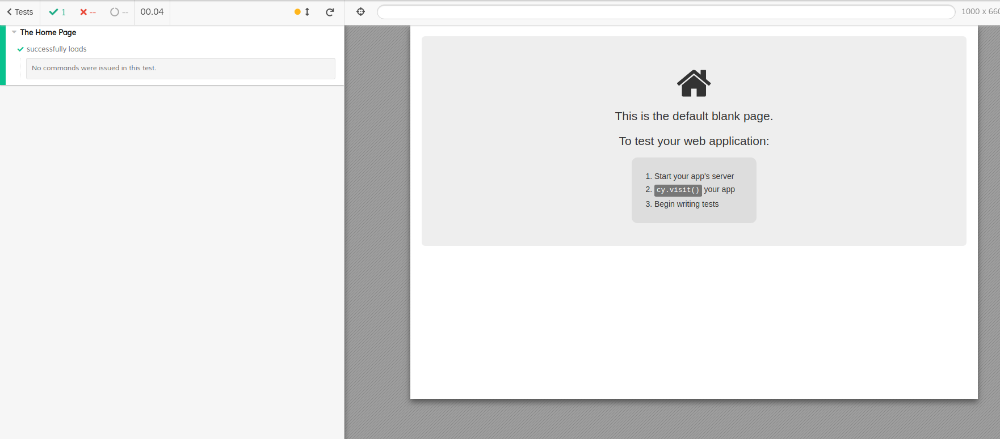

# 1. The Cypress Test runner

On your command line run:

```text
npm run cypress
```

This will open the Cypress Test Runner. Clicking on a spec file will run that specific test. Click on "1-first-test.spec.js" now.

Your browser should open and you should see this:



This is how you run tests, now let's make it do something!

