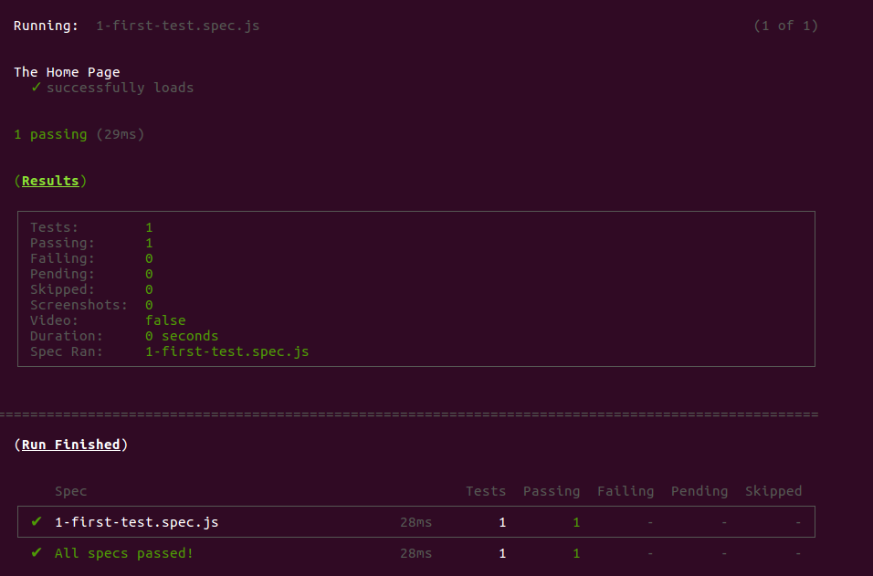

# Cypress Training \(Setup\)

## Prerequisite

Tool kit you need to have installed on your machine:

* [npm](https://www.npmjs.com/)
* [Git](https://git-scm.com/)
* [Google Chrome](https://www.google.nl/chrome/)
* Editor \([Intelij](https://www.jetbrains.com/idea/), [vscode](https://code.visualstudio.com/), [vim](https://www.vim.org/) choose whatever you feel comfortable\)

Knowledge

* basic understanding Javascript, HTML, CSS
* basic understanding of [bbd](https://en.wikipedia.org/wiki/Behavior-driven_development)


If you are reading this from Github, the documentation is better readable from here: [https://flock-community.gitbook.io/cypress-training/](https://flock-community.gitbook.io/cypress-training/)


## Installing

Clone the training [repository](https://github.com/flock-community/cypress-training):

```bash
git clone git@github.com:flock-community/cypress-training.git
```

> Navigate to the folder and install the packages:

```bash
cd cypress-training

npm i
```

> ## Testing the install

When you run:

```bash
npm test --spec "cypress/solution/1-first-test.spec.js"
```

Then you should see:



## Done!

You are done with the setup. Continue to the [next page](1.-basics/introduction.md) to start the training.

